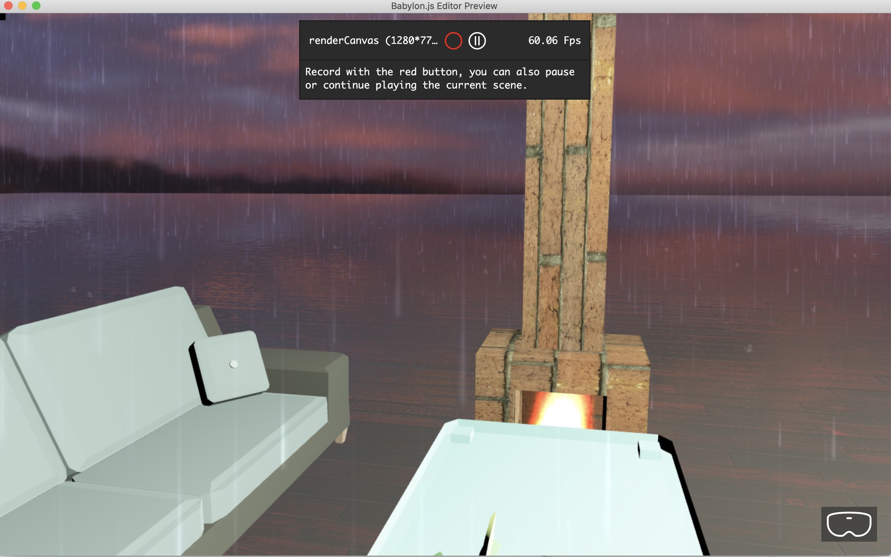

# A sample contents from Babylon.js Editor




Get the great editor from [Get Started Babylon.js Editor](https://doc.babylonjs.com/resources/getting_started)  

Desktop app is recommended.  

# Usage

## Installing dependencies
In order to retrive the dependencies such as Babylon.js, don't forget to install the dependencies:
```bash
npm install
```

## Building the project
In order to build the game, just type:
```bash
npm run build
```

## Watching for changes
To run the watch mode, just type:
```bash
npm run watch
```

## Running the project
To run a local webserver and test your project in a web browser, just type:
```bash
npm run webserver
```

And access http://localhost:1338/index.html

# model

Thanks for great models!  

## Couch | Wde (by Danny Bittman)  

https://poly.google.com/view/7Q_Ab2HLll1

CC-BY  

## Plant - Flower Pot (by Alex “SAFFY” Safayan)  

https://poly.google.com/view/bVepm2yfJTh  

CC-BY